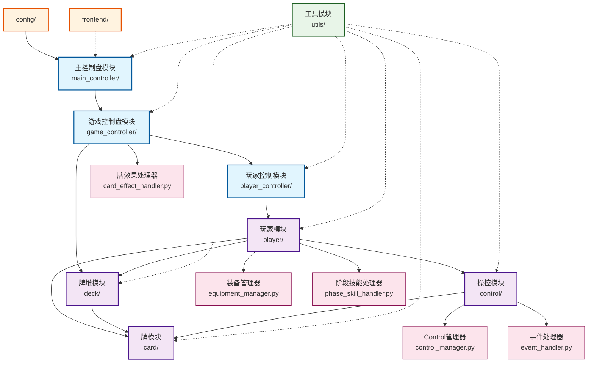
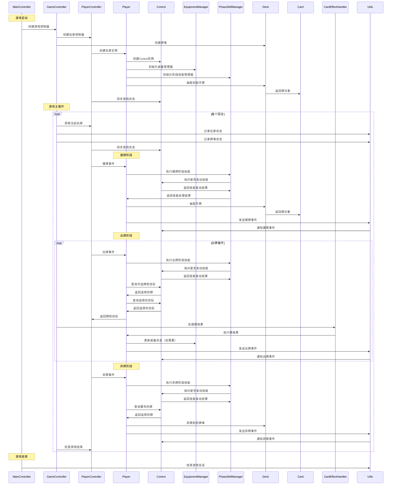
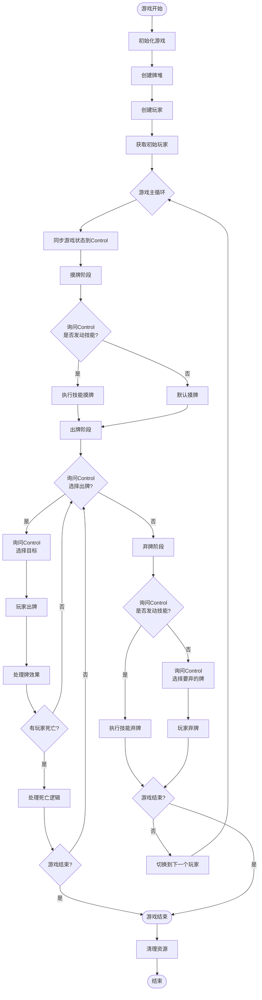

# 后端架构图

本文档包含后端模块的架构图和运行逻辑图，用于可视化理解模块间的关系和数据流。

## 模块间联系示意图

### 模块依赖关系说明

- **实线箭头**: 直接依赖关系，表示模块A直接使用模块B
- **虚线箭头**: 间接依赖关系，表示模块A通过其他模块间接使用模块B
- **核心模块**: 控制游戏流程的主要模块（蓝色）
- **数据模块**: 管理游戏数据和状态的基础模块（紫色）
- **工具模块**: 提供通用功能的支持模块（绿色）
- **外部模块**: 项目外部依赖（橙色）
- **子模块**: 模块内部的辅助类（粉色）

## 游戏运行时数据流图

## 游戏主循环详细流程

