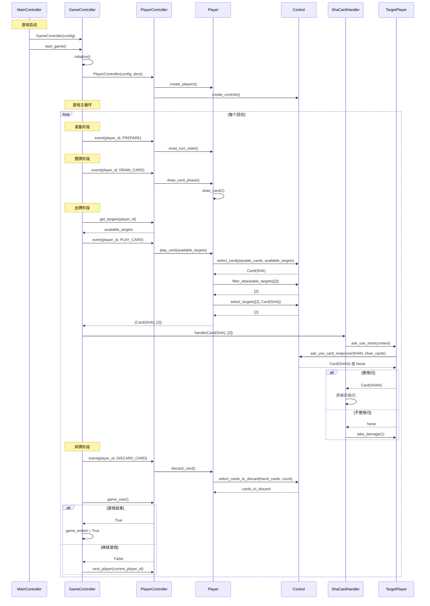

# 后端代码示例

本文档通过具体示例说明后端代码的执行流程，帮助开发者理解各模块之间的交互。

## 示例：一个角色如何出一张杀，目标为另一个角色

本示例详细说明当玩家A（ID=1）对玩家B（ID=2）使用"杀"牌时的完整执行流程，从游戏启动到出牌完成。

### 场景设定

- **玩家A**: ID=1，手牌中有"杀"牌，当前回合未使用过杀
- **玩家B**: ID=2，在玩家A的攻击范围内（逆时针距离≤1）
- **游戏状态**: 游戏主循环进入出牌阶段

### 完整执行流程

#### 阶段一：游戏启动和初始化

##### 1. MainController 创建 GameController

```python
# 位置: backend/main_controller/main_controller.py

main_controller.start_game()
  → game_controller = GameController(config)
  → game_controller.start_game()
```

##### 2. GameController 初始化

```python
# 位置: backend/game_controller/game_controller.py

game_controller.start_game()
  → self.initialize()
    → self.deck = Deck(config)
    → self.player_controller = PlayerController(config, deck)
    → self.current_player_id = player_controller.get_initial_player()
```

##### 3. PlayerController 创建玩家和 Control

```python
# 位置: backend/player_controller/player_controller.py

player_controller = PlayerController(config, deck)
  → players = PlayerFactory.create_players(config, deck)
  → control_manager = ControlManager(players)
  → control_manager.sync_game_state()
```

#### 阶段二：游戏主循环

##### 4. 准备阶段

```python
# 位置: backend/game_controller/game_controller.py

player_controller.event(current_player_id, GameEvent.PREPARE)
  → player.reset_turn_state()
  → control_manager.sync_game_state()
```

##### 5. 摸牌阶段

```python
# 位置: backend/game_controller/game_controller.py

player_controller.event(current_player_id, GameEvent.DRAW_CARD)
  → player.draw_card_phase()
    → phase_skill_manager.execute_phase(player, GameEvent.DRAW_CARD)
      → handler.execute_default(player)
        → player.draw_card_phase_default()
          → player.draw_card(2)
  → control_manager.sync_player_state(current_player_id)
```

#### 阶段三：出牌阶段（出杀）

##### 6. 获取可用目标

```python
# 位置: backend/game_controller/game_controller.py

available_targets = player_controller.get_targets(current_player_id)
  → calculate_distance(player_id, target_id)
  # 返回: {"attackable": [2, 3], "all": [2, 3, 4], "distance_1": [2]}
```

##### 7. 玩家出牌请求

```python
# 位置: backend/game_controller/game_controller.py

card, targets = player_controller.event(current_player_id, GameEvent.PLAY_CARD)
  → player.play_card(available_targets)
```

##### 8. 阶段技能管理器处理

```python
# 位置: backend/player/phase_skill_handler.py

player.play_card(available_targets)
  → phase_skill_manager.execute_phase(player, GameEvent.PLAY_CARD, available_targets)
    → handler.execute_default(player, available_targets)
      → player.play_card_default(available_targets)
```

##### 9. 执行默认出牌流程

```python
# 位置: backend/player/player.py

player.play_card_default(available_targets)
  → playable_cards = _get_playable_cards(available_targets)
  → selected_card = control.select_card(playable_cards, "", available_targets)
  → targets = _get_targets_for_card(selected_card, available_targets)
  → targets = control.filter_attackable_targets(targets, available_targets)  # 对于杀牌
  → selected_targets = control.select_targets(targets, selected_card)
  → hand_cards.remove(selected_card)
  → send_play_card_event(selected_card, player_id, selected_targets)
  # 返回: (Card(SHA), [2])
```

##### 10. Control 选择牌和目标

```python
# 位置: backend/control/simple_control.py

control.select_card(playable_cards, "", available_targets)
  # 返回: Card(SHA)

control.filter_attackable_targets([2], available_targets)
  → _calculate_distance(player_id, target_id)
  # 返回: [2]

control.select_targets([2], Card(SHA))
  # 返回: [2]
```

##### 11. 处理牌效果

```python
# 位置: backend/game_controller/game_controller.py

game_controller._handle_card_effect(card, targets)
  → handler = CardEffectHandlerFactory.create_handler(card, game_controller)
  → handler.handle(card, targets)
```

##### 12. 杀牌效果处理器执行

```python
# 位置: backend/game_controller/card_effect_handler.py

sha_card_handler.handle(card, targets)
  → target_player = player_controller.get_player(target_id)
  → ignore_armor = check_qing_gang_jian(attacker_player)
  → if ren_wang_dun_check(): discard_card(card); return
  → shan_card = target_player.ask_use_shan(context)
  → if shan_card: discard_card(card); discard_card(shan_card); return
  → target_player.take_damage(1, attacker_id, "杀")
  → discard_card(card)
  → if target_player.current_hp == 0: _handle_dying_process(target_id)
```

##### 13. 目标玩家响应询问

```python
# 位置: backend/player/player.py

target_player.ask_use_shan(context)
  → shan_cards = filter_shan_cards(hand_cards)
  → control.ask_use_card_response(CardName.SHAN, shan_cards, context)
  # 返回: Card(SHAN) 或 None
```

##### 14. 同步状态

```python
# 位置: backend/game_controller/game_controller.py

control_manager.sync_game_state()
  → for player in players:
      control.sync_state(state)
```

#### 阶段四：弃牌阶段

##### 15. 弃牌阶段

```python
# 位置: backend/game_controller/game_controller.py

player_controller.event(current_player_id, GameEvent.DISCARD_CARD)
  → player.discard_card()
    → phase_skill_manager.execute_phase(player, GameEvent.DISCARD_CARD)
      → handler.execute_default(player)
        → player.discard_card_default()
          → cards_to_discard = control.select_cards_to_discard(hand_cards, count)
          → discard_cards(cards_to_discard)
  → control_manager.sync_player_state(current_player_id)
```

#### 阶段五：回合结束

##### 16. 检查游戏结束

```python
# 位置: backend/game_controller/game_controller.py

if player_controller.game_over():
  → winner = player_controller.get_winner()
  → game_ended = True
```

##### 17. 切换到下一个玩家

```python
# 位置: backend/game_controller/game_controller.py

next_player_id = player_controller.next_player(current_player_id)
current_player_id = next_player_id
```

### 完整流程图



### 关键代码位置总结

1. **游戏启动**: `backend/main_controller/main_controller.py` - `start_game()`
2. **游戏初始化**: `backend/game_controller/game_controller.py` - `initialize()`
3. **游戏主循环**: `backend/game_controller/game_controller.py` - `start_game()`
4. **准备阶段**: `backend/player/player.py` - `reset_turn_state()`
5. **摸牌阶段**: `backend/player/player.py` - `draw_card_phase()`
6. **出牌阶段**: `backend/player/player.py` - `play_card()`
7. **默认出牌流程**: `backend/player/player.py` - `play_card_default()`
8. **Control选择牌**: `backend/control/simple_control.py` - `select_card()`
9. **Control选择目标**: `backend/control/simple_control.py` - `select_targets()`
10. **牌效果处理**: `backend/game_controller/card_effect_handler.py` - `ShaCardHandler.handle()`
11. **目标响应询问**: `backend/player/player.py` - `ask_use_shan()`
12. **弃牌阶段**: `backend/player/player.py` - `discard_card()`

### 注意事项

1. **攻击范围计算**: 杀牌的目标选择需要考虑逆时针距离，而不是最小距离。这通过 `Control.filter_attackable_targets()` 方法实现。

2. **回合状态管理**: 玩家出杀后，会设置 `sha_used_this_turn = True`，防止同一回合再次出杀（除非装备了诸葛连弩）。

3. **目标过滤**: 在 `play_card_default()` 中，会确保目标列表中不包含自己（除了 `TargetType.SELF` 类型的牌）。

4. **事件发送**: 出牌事件会通过 `send_play_card_event()` 发送到前端，用于动画显示。

5. **技能处理**: 如果玩家有出牌阶段技能（如张飞的"咆哮"），会先询问是否发动技能，再执行对应的出牌流程。

6. **状态同步**: 每个阶段结束后，会调用 `control_manager.sync_game_state()` 或 `sync_player_state()` 同步游戏状态到所有 Control 实例。
